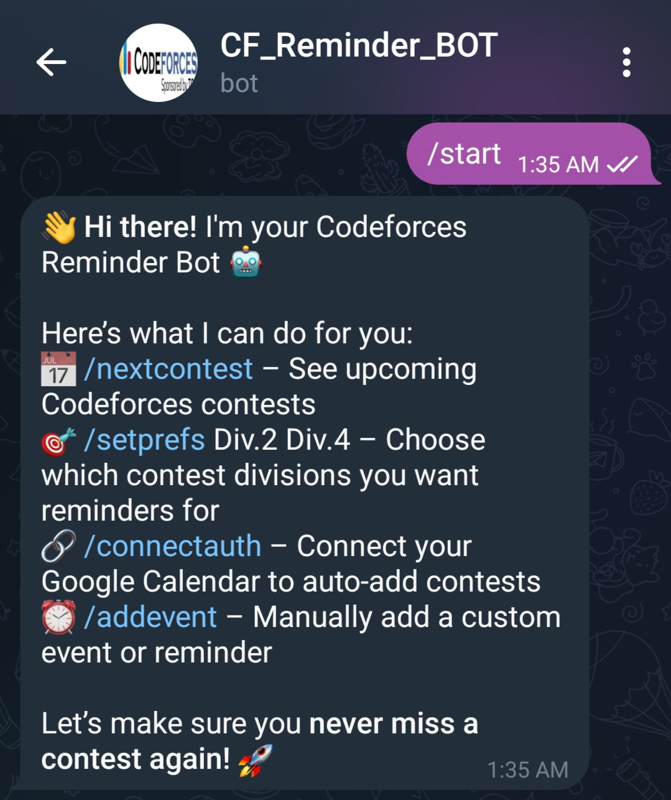
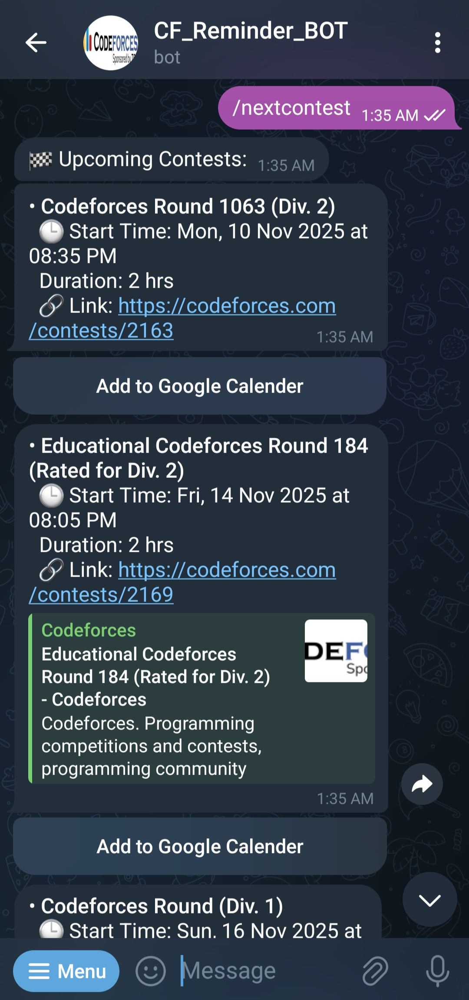
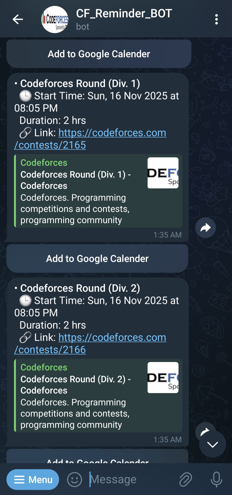
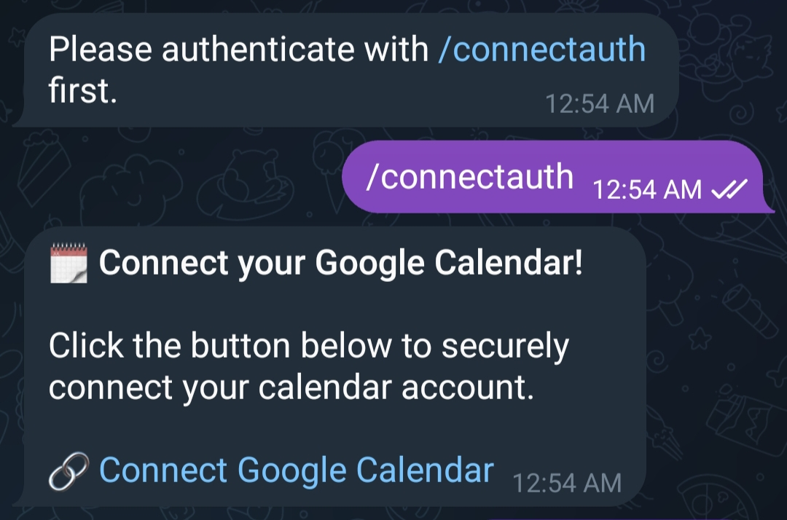
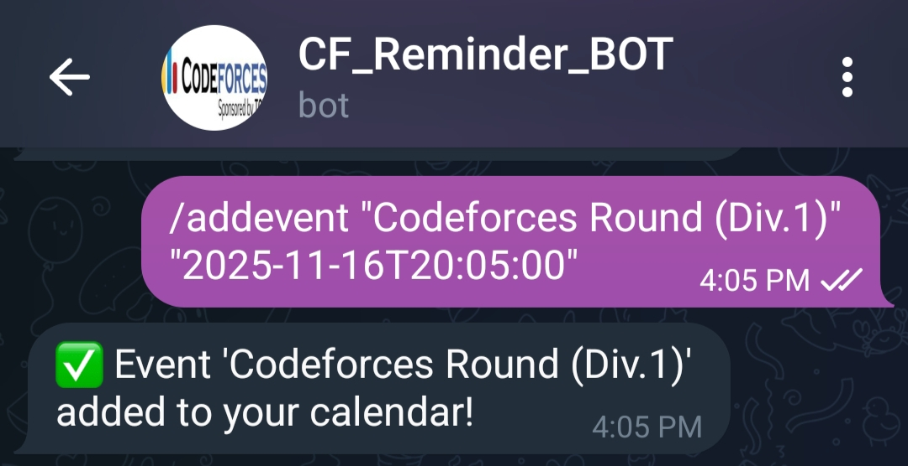
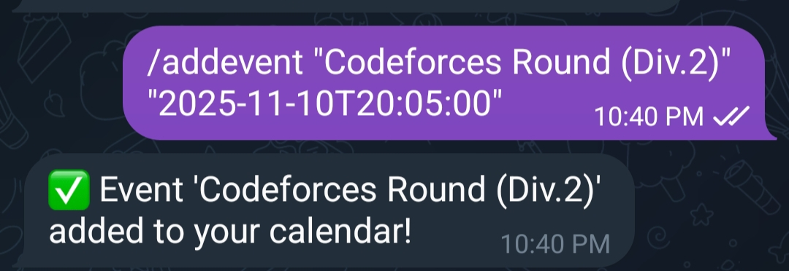
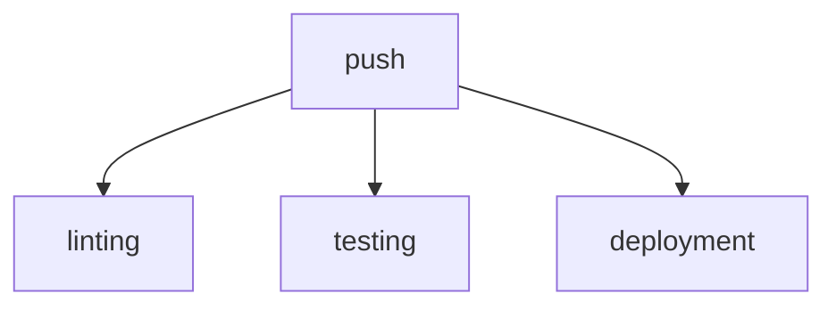

# Codeforces Reminder Bot 🤖

## 🗂️  Description

The Codeforces Reminder Bot is a Telegram bot designed to help competitive programmers stay on top of their contest schedule. It integrates with Google Calendar to provide personalized reminders for upcoming contests on the Codeforces platform. This project is perfect for programmers who want to stay organized and focused on their coding goals.

The bot is built using Python and leverages popular libraries like python-telegram-bot and FastAPI to provide a seamless experience. With its user-friendly interface and robust features, the Codeforces Reminder Bot is an essential tool for any competitive programmer.

## ✨ Key Features

### Core Features

* **Contest Reminders**: Receive notifications for upcoming contests on Codeforces
* **Google Calendar Integration**: Connect your Google Calendar to schedule events and reminders
* **User-Friendly Interface**: Interact with the bot using simple commands like `/start`, `/setprefs`, and `/nextcontest`

### Bot Commands

* `/start`: Initialize the bot and start using it
* `/setprefs`: Configure your preferences for contest reminders
* `/nextcontest`: Get information about the next contest
* `/connectauth`: Connect your Google Calendar account
* `/addevent`: Add a contest event to your Google Calendar

## start of the Bot

## nextcontest of the Bot

## connectauth of the Bot

## addevent of the Bot

## 🛠️ Tech Stack

## ⚙️ Setup Instructions

To run the project locally, follow these steps:

* Clone the repository: `git clone https://github.com/SaMaJiT7/Codeforces_Reminder_BOT.git`
* Install dependencies: `pip install -r requirements.txt`
* Set environment variables for Google Calendar API and Codeforces API
* Run the server: `uvicorn server:app --host 0.0.0.0 --port 8000`
* Run the bot: `python codeforces.py`

## 📈 GitHub Actions

This repository uses GitHub Actions to automate testing and deployment. The workflow is triggered on push events to the main branch and runs the following jobs:

* **Linting**: Checks for code style and syntax errors
* **Testing**: Runs unit tests and integration tests
* **Deployment**: Deploys the bot to a production environment

  

<h3>SAMAJIT NANDI</h3>

No information available.

 

  <a href="https://gitfull.vercel.app">Made by GitFull</a>

    